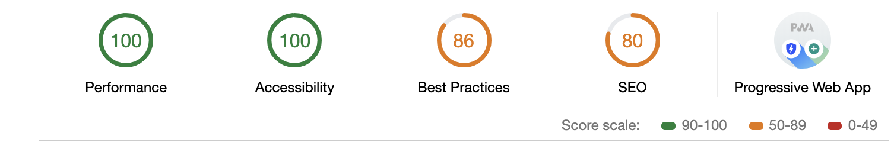
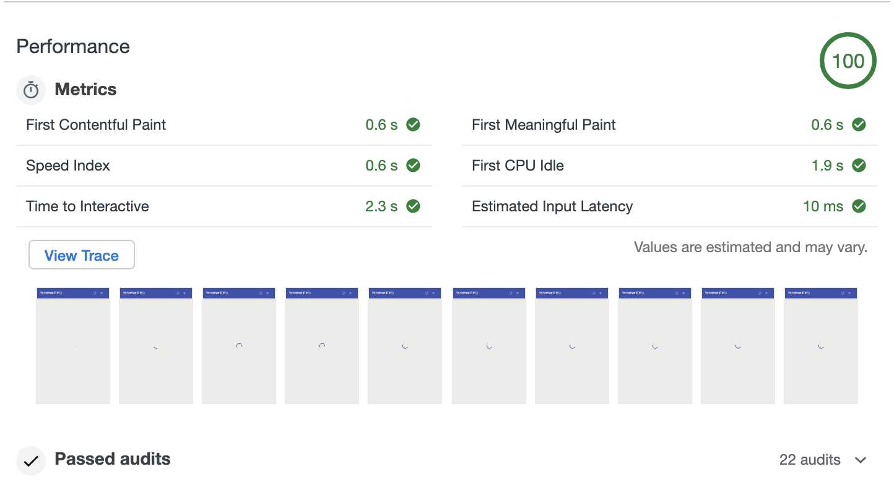
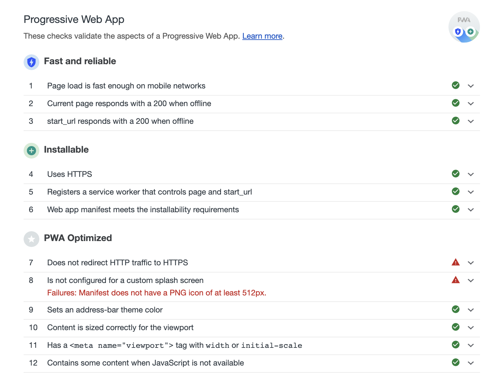

# Maleo Progressive Web Application Example

This example is ported from [Google's PWA Tutorial](https://developers.google.com/web/fundamentals/codelabs/your-first-pwapp/) to work with Maleo

### Showcase

## Lighthouse Audit result

### Overall

### Performance

### PWA

